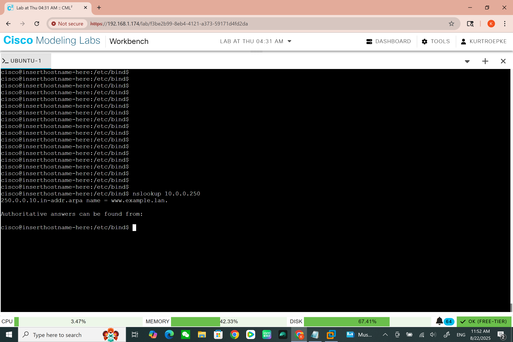

<h1>Bind 9 Primary and secondary dns server</h1>
  
<h2>Description</h2>
Project consisting of a bind9 primary and secondary server connected to a Cisco ASA DMZ interface. To check functionality, i connected a client machine to an internal interface and finally linked the asa to an external connecter to access the outside network.
 

<h2></h2>

- <b>Cisco CML 2.8</b> 
- <b>Bind9</b>
- <b>Ubuntu terminal</b>

<h2>Environments Used </h2>

- <b>Windows 10</b> (21H2)

<h2>Program walk-through:</h2>

The topology we will be using  

 
 
Configure interfaces on asa firewall 

 
Configure the interfaces on the ASA firewall while changing the security level
of the DMZ zone to 50, so the internal interface can ping the DMZ. 
 
 
Create default route 

 
Because ASA firewalls don't inspect ICMP packets by default, we have to modify the policy map
to inspect ICMP. 
  
  
  Configure pat  

   
Next, create a network object to configure PAT to allow traffic to the outside network.
A default route is also needed so network traffic knows how to get to the outside network. 
   
   
 Set up basic network functions   
 
  
 Now we are ready to set up the Ubuntu machine. Modify the netplan
file to set up basic addresses for network connectivity to allow for updates 
and to install bind9. 
 
 
Download bind9 

  
Before we install bind9, it's best to make sure the operating system is updated 
using the sudo apt-get update command. Then use the 
"sudo apt install bind9 bind9utils bind9-doc -y"to install bind9.  
 
 
Change netplan 

   
 Now we need to change the DNS server in the netplan file to use itself as the 
DNS server because we have downloaded all the files we need. 
 
 
Named.conf.options 

 
 This is the main file of Bind 9 DNS. First, it's good to have an ACL for security 
reasons. This is also the file where you would add the DNS forwarders and allow queries. 
 
 
Named.conf.local  

 
This is where you declare different zones. For this example, we have a forward
and reverse zone. For the reverse zone DNS looks up an IP from right to left
, so one half of the IP is here, and the other is in the actual zone file. 
 
 
Stop resolving ipv6   

 !!next!!  
Here we are not using IPv6 at this time, so we should go into the 
/etc/default/named file and allow only to resolve IPv4 addresses.
This will simplify the logs. 
 
 
Create zone file 

   
The zone file is the main file for our DNS zone. It consists of different timers
and different DNS records. 
 
 
Configure reverse zone 

  
 This file is similar to the file above, but instead of resolving domain names to IP addresses
Addresses it resolves ip addresses to domain names. 
 
 
Check funtionality 

  
Finally, use nslookup to make sure you can resolve both forward and reverse DNS queries. 
 
 

