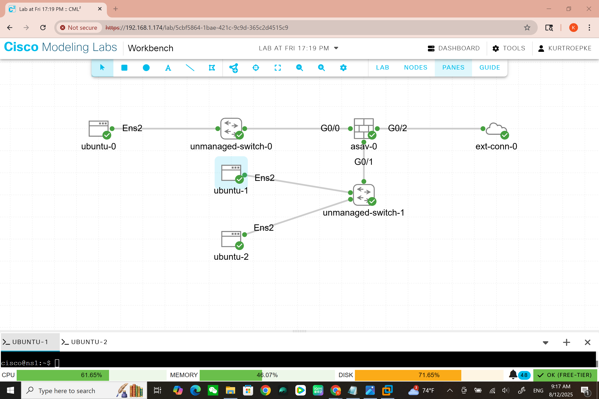

<h1>Bind 9 Primary and secondary dns server</h1>
  
<h2>Description</h2>
Project consisting of a bind9 primary and secondary server connected to a cisco asa dmz interface. To check functionality i then connected a client machine to an internal interface and finally linked the asa to an external connecter to access the outside network.
<br />


<h2></h2>

- <b>Cisco CML 2.8</b> 
- <b>Bind9</b>
- <b>Ubuntu terminal</b>


<h2>Environments Used </h2>

- <b>Windows 10</b> (21H2)

<h2>Program walk-through:</h2>

<p align="center">
The topology we will be using <br/>


<br />
<br />
Configure interfaces on asa firewall<br/>

<br />
 Configure the interfaces on the asa firewall while changing the security level
 of the dmz zone to 50 so the internal interface can ping the dmz.<br />
<br />
<br />
Create default route<br/>

<br />
Create a default route pointing to the external network router to allow
access to the external network. Here we will also modify the policy map
because the asa doesnt inspect icmp by default.<br />
 <br />
 <br />
  Configure pat <br />

  <br />
  create a network object for both the internal network and the dmz.<br />
  <br />
  <br />
Next add an ip address to the object and point it to the external
interface.<br />
<br />
<br />
Change hostname on nameserver <br/>

  text<br />
<br />
<br />
Download bind9<br/>

<p align="center">first use command "sudo apt-get update" to update the machine next use 
 <br /> 
"sudo apt install bind9 bind9utils bind9-doc -y" to install bind9.</p>
<br />
<br />
Change netplan<br/>

Modify the netplan file to change the dns server to its self using the
loopback interface and its own ip address.<br />
<br />
<br />
Named.conf.options<br/>

This is the main file of bind 9 dns. first its good to have an acl for security 
resons. This is also where you would add the dns forwarders and allow queries.<br />
<br />
<br />
<head align="center">Named.conf.local<head/>

  <br />
This is were you declare diffrent zones for this example we have a forward
and reverse zone. for the reverse zone dns looks up an ip for right to left
so one half of the ip is here ans the other in the actual zone file.<br />
<br />
<br />
<head>Stop resolving ipv6</head>

 <br /> 
Here we are not using ipv6 at this time so we should go into the 
/etc/default/named file and allow only to resolve ipv4 address.
this will simplify the logs.<br />
<br />
<br />
Create soa file<br/>

 <br /> 
The soa file it the main conifguration file for the zone. Here we have many diffrent 
timers and the main dns files.<br />
<br />
<br />
configure reverse zone<br/>

 <br /> 
This file is similar to the file above but intsted of resolving domain names
it resolves an ip address to a domain name.<br />
<br />
<br />
add image of fuctioning output<br/>


<!--
 ```diff
- text in red
+ text in green
! text in orange
# text in gray
@@ text in purple (and bold)@@
```
--!>

